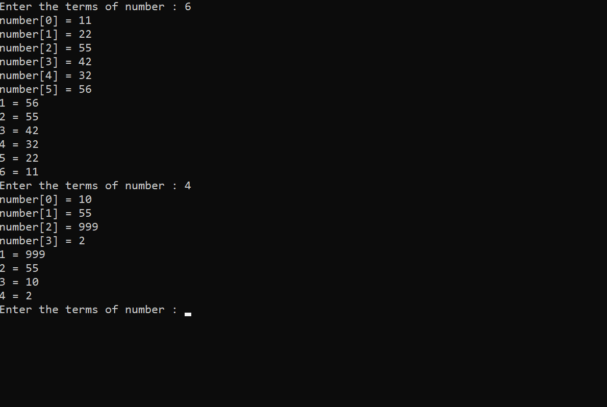

<!--tring to make a programme that print maximum to minimum created by myself-->
_maximum_ ~~to~~ __minimum__`by me`

### C programme maximum to minimum 

```c
#include<stdio.h>
int main()
{
    while(1)
    {
        int number[100],n,maximum,j,latest,minimum,update;
        printf("Enter the terms of number : ");
        scanf("%d",&n);

        for(int index=0; index<n; index++)
        {
            printf("number[%d] = ",index);
            scanf("%d",&number[index]);
        }


        maximum=number[0];
        minimum=number[0];
        for(int i=1; i<n; i++)
        {
            if(number[i]>maximum)
            {
                maximum=number[i];
            }
            if(number[i]<minimum)
            {
                minimum=number[i];
            }
        }
        latest=maximum;
        printf("1 = %d\n",latest);


        for(int i=1; i<n; i++)
        {
            update=minimum;

            for(j=0; j<n; j++)
            {
                if(number[j]<latest && number[j]>=minimum)
                {
                    if(number[j]>=update)
                        maximum=number[j];
                    update=maximum;
                }
            }
            latest=maximum;
            printf("%d = %d \n",i+1,latest);
        }
    }
    return 0;
}
```


</br>

<!--write a programme that print minimum to maximum-->

### terms of series minimum to maximum number with array

```c
#include<stdio.h>
int main()
{
    while(1)
    {
        int number[100],n,maximum,j,latest,minimum,update;
        printf("Enter the terms of number : ");
        scanf("%d",&n);

        for(int index=0; index<n; index++)
        {
            printf("number[%d] = ",index);
            scanf("%d",&number[index]);
        }


        maximum=number[0];
        minimum=number[0];
        for(int i=1; i<n; i++)
        {
            if(number[i]>maximum)
            {
                maximum=number[i];
            }
            if(number[i]<minimum)
            {
                minimum=number[i];
            }
        }
        latest=minimum;
        printf("1 = %d\n",latest);


        for(int i=1; i<n; i++)
        {
            update=maximum;

            for(j=0; j<n; j++)
            {
                if(number[j]>latest && number[j]<=maximum) // 2>1 latest && 2<=5 , 3>2 && 3>=5
                {
                    if(number[j]<=update) // 5,3,4,2,1= latest=1,loop1,5>latest5<updatex
                    {                          // loop2, 3>latest,3<update5 yes; now update =3
                        minimum=number[j]; //  loop3, 4>latest,4<update x no
                        update=minimum; // loop 4, 2>latest,2<latest3,yes,now update=2
 // loop5, 1>latest1,nox; latest 2, 2 cancel number>2
                    }
                }
            }
            latest=minimum; // 2
            printf("%d = %d \n",i+1,latest);
        }
    }
    return 0;
}
```

<image src="./images/mintomax.png" width="500" title="mintomax"/>

</br>